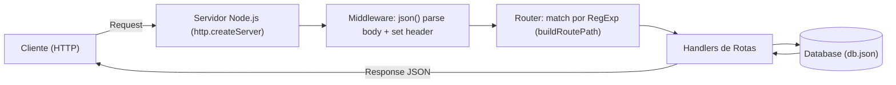

# Money Map API

API minimalista em Node.js (HTTP nativo, ES Modules) para gestão de finanças pessoais, com persistência em arquivo JSON. Simplicidade e didática, este projeto não utiliza biblioteca de terceiros e o motivo para isso foi pelo objetivo de estudar HTTP puro.


## Sumário
- [Visão Geral](#visão-geral)
- [Arquitetura](#arquitetura)
- [Como Executar](#como-executar)
- [Rotas da API](#rotas-da-api)
- [Modelo de Dados](#modelo-de-dados)
- [Agradecimentos](#agradecimentos)


## Visão Geral
- **Stack**: Node.js (HTTP nativo), ES Modules, sem frameworks, persistência em `db.json`.
- **Objetivo**: disponibilizar endpoints para categorias, lançamentos e cálculo de saldo.
- **Porta padrão**: `3333`.

### Diagrama (Mermaid)
O diagrama abaixo mostra o fluxo básico de uma requisição HTTP até a camada de persistência.



## Arquitetura
Estrutura de diretórios (essencial):

```
src/
  server.js                   # Cria o servidor HTTP, aplica middleware e despacha rotas
  routes.js                   # Declaração das rotas (categorias, lançamentos, saldo)
  database.js                 # Persistência em arquivo JSON (db.json)
  middlewares/
    json.js                   # Middleware para parse do body e Content-Type
  utils/
    build-route-path.js       # Constrói RegExp para rotas com parâmetros e query
    extract-query-params.js   # Parseia query string
db.json                       # Base de dados (categorias, lançamentos)
package.json
```

Pontos-chave:
- Matching de rotas via `RegExp` gerada por `buildRoutePath`.
- `json` middleware lê o corpo da request e define `Content-Type: application/json`.
- `Database` realiza `select`, `insert`, `update`, `delete` com persistência em arquivo (`fs/promises`).
- Cálculo de saldo é feito em memória a partir dos lançamentos.

## Como Executar
Pré-requisitos: Node.js 22.18+.

1. Instale o projeto na sua máquina:
```
git clone https://github.com/matheushnt/money-map-api.git
```
2. Inicie em modo desenvolvimento:
```
npm run dev
```
3. A API estará acessível em `http://localhost:3333`.

## Rotas da API

Base URL: `http://localhost:3333`

- Categorias
  - `GET /categorias?search=<texto>`: lista categorias (filtro por nome opcional)
  - `POST /categorias`: cria categoria `{ nome }`
  - `PUT /categorias/:id`: atualiza categoria por id
  - `DELETE /categorias/:id`: remove categoria por id

- Lançamentos
  - `GET /lancamentos?tipo=receita|despesa`: lista lançamentos (filtro por tipo opcional)
  - `POST /lancamentos`: cria lançamento `{ tipo, valor, data, categoriaId }`
  - `PUT /lancamentos/:id`: atualiza lançamento por id
  - `DELETE /lancamentos/:id`: remove lançamento por id

- Saldo
  - `GET /saldo`: retorna `{ totalReceitas, totalDespesas, saldo }`

## Modelo de Dados

Categoria:
```
{
  "id": "uuid",
  "nome": "string"
}
```

Lançamento:
```
{
  "id": "uuid",
  "tipo": "receita" | "despesa",
  "valor": number, (valor salvo em centavos)
  "data": "YYYY-MM-DD",
  "categoriaId": "uuid"
}
```

Saldo:
```
{
  "totalReceitas": number,
  "totalDespesas": number,
  "saldo": number
}
```

## Agradecimentos

A todas as pessoas que me incentivam a continuar estudando e construindo — família, amigos e comunidade dev — meu muito obrigado. Este projeto nasceu do desejo de aprender HTTP do zero; feedbacks são sempre bem-vindos. Obrigado por ler e experimentar!
